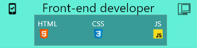

<h1 align="center">Hi 👋, I'm Yahya</h1>
<h3 align="left">I'm passionate, professional and curious web developer.</h3>

<h3 align="left">Languages and Tools:</h3>

    

- 💬 Ask me about **HTLM, CSS AND JAVASCRIPT.**
  
- 🌱 I’m currently learning **JAVASCRIPT**

- 👨‍💻 All of my projects are available at [https://github.com/theeagleyahya?tab=repositories](https://github.com/theeagleyahya?tab=repositories)

- 📫 How to reach me **yahyahunt6@gmail.com**

- ⚡ Fun fact **I love to play video games**

&nbsp;

